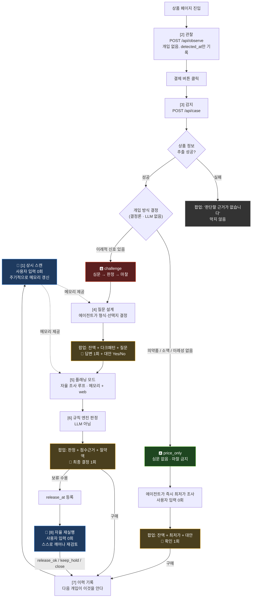
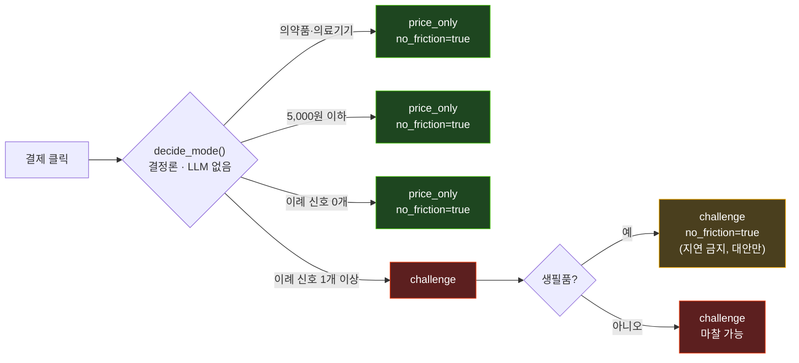
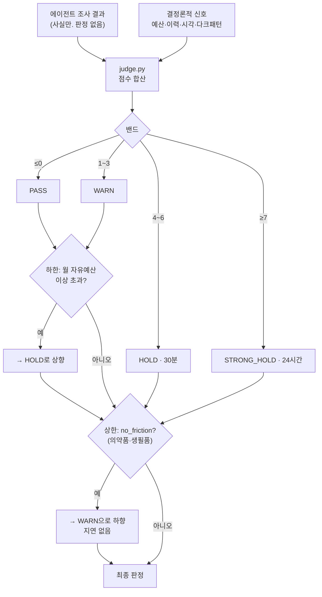
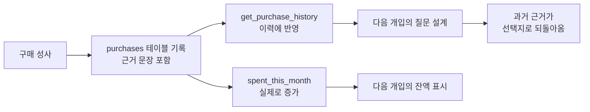

# Ulysses — 전체 워크플로우

> 온라인 결제 직전에 개입해, 구매 근거를 조사하고 규칙 기반으로 판정한 뒤 실제 마찰을 적용하는 자율 에이전트.
> 구매를 막는 것이 아니라 **결정에 쓸 시간을 되돌려주는 것**이 목적이다. 최종 결정권은 항상 사용자에게 있다.

---

## 0. 한눈에 보기



**사용자가 손을 대는 횟수**

| 모드 | 클릭 수 | 내역 |
| --- | --- | --- |
| `price_only` | **1회** | 확인 버튼만 |
| `challenge` | **2회** | ① 질문 답변 ② 최종 결정 |
| 자율 재실행 | **0회** | 에이전트가 스스로 깨어남 |

조사·도구 선택·종료 시점·대안 방식·메모리 기록은 전부 에이전트가 결정한다.

---

## 1. 감지하는 것

### 1-1. 상품·페이지에서

| 항목 | 출처 | 확실성 |
| --- | --- | --- |
| 상품명·가격·카테고리 | 확장 프로그램 DOM 파싱 | 사이트별 셀렉터에 의존 |
| 할인 문구 | DOM | 문구 존재만 |
| 쇼핑몰 식별 | URL 호스트 매칭 | 확실 |
| 통화 → 원화 환산 | 사이트별 통화 + 고정 환율 | **추정치** (화면에 명시) |
| 다크패턴 | 텍스트 휴리스틱 + DOM 신호 | 아래 표 참조 |

### 1-2. 사용자 상태에서

| 항목 | 계산 방식 | 판정 반영 |
| --- | --- | --- |
| `dwell_minutes` | `checkout_at − detected_at` | 30분 미만 → **+2** |
| 결제 시각 | 서버 시각 | 00–04시 → **+2** |
| 예산 초과 | 자유예산 − 이번달사용 − 가격 | 초과 **+3** / 월예산 이상 초과 **+4** |
| 예정 지출 압박 | 캘린더 합계 vs 잔액 | 부족 시 **+2** |
| 동일 카테고리 보유 | 등록된 보유품 | 3개 이상 **+2** |
| 30일 내 유사 구매 | 시드 이력 + **런타임 구매** | 있음 **+2** |
| 보류 후 재시도 | 같은 상품의 과거 HOLD 조회 | **+3** |
| 후불결제·할부 | 확장이 전달 | **+2** |
| 고가 상품 | 50만원 이상 | **+2** |

### 1-3. 다크패턴 — 실제 사이트에서 어디까지 가능한가

전자상거래법(2025-02-14 시행) 금지 6개 유형 + 긴급성 조작을 대상으로 한다.
**중요한 것은 "무엇을 확인했는가"와 "무엇을 확인하지 못했는가"를 구분하는 것이다.**

| 유형 | 탐지 근거 | 실제 사이트 가능성 | 지금 상태 |
| --- | --- | --- | --- |
| 긴급성 조작 | `text` → `dom` | 문구는 확실히 잡힘. **재고가 진짜 3개인지는 원리적으로 확인 불가** | 문구 탐지 O, 타이머 DOM 확정 O |
| 순차공개 가격책정 | `text` | "배송비 별도" 등 문구 탐지 가능 | O |
| 숨은 갱신 | `text` | "첫 달 무료", "자동 연장" 문구 탐지 가능 | O |
| 반복간섭 | `text` | 문구는 잡히나 *반복* 여부는 세션 추적 필요 | 부분 |
| 특정옵션 사전선택 | `dom` | **문구만으로는 판단 불가.** `input:checked` 상태를 봐야 함 | DOM 신호 받으면 확정 |
| 취소·탈퇴 방해 | `flow` | 해지 절차를 실제로 밟아봐야 함. **우리는 못 함** | 문구 탐지까지만 |
| 잘못된 계층구조 | 시각 | 색·크기 대비 분석 필요 | **미구현** |

응답에 이 구분이 그대로 드러난다.

```jsonc
// 페이지 텍스트만 봤을 때
{ "type": "특정옵션 사전선택", "evidence": "정기배송 신청",
  "basis": "dom", "confirmed": false,
  "note": "문구만 확인했습니다. 실제로 사전 선택되어 있는지는 확장 프로그램의 DOM 신호가 있어야 확정됩니다." }

// 확장이 DOM 신호를 보냈을 때
{ "type": "특정옵션 사전선택", "evidence": "안심 추가보증 3개월 +4,900원",
  "basis": "dom", "confirmed": true,
  "note": "확장 프로그램이 DOM에서 직접 관찰했습니다." }
```

> **실제 사이트 적용 시 예상 한계 (정직한 평가)**
> - 쿠팡·무신사에서 확실히 되는 것: **긴급성 문구, 배송비 별도, 무료체험/자동연장 문구, 사전선택 체크박스(DOM)**
> - 원리적으로 안 되는 것: **재고·타이머 주장의 진위**, **취소 방해 절차**
> - 추가 작업이 필요한 것: 반복간섭(세션 추적), 잘못된 계층구조(시각 분석)
>
> 그래서 화면에는 항상 "문구만 확인 · 진위 미확인"이라고 표시한다.
> 확인하지 못한 것을 확인한 척하는 것이 이 프로젝트에서 가장 큰 실패다.

---

## 2. 개입 방식 분기 — 팝업은 항상 뜬다

어떤 구매도 그냥 통과시키지 않는다. 달라지는 것은 **팝업이 하는 일**이다.



**이례 신호** (하나라도 있으면 `challenge`)

- 잔여 예산 초과 · 50만원 이상 · 월 자유예산의 5% 초과
- 최근 30일 내 같은 카테고리 구매
- 발견 후 24시간 이내 결제
- 다크패턴 탐지됨
- 보류 판정 후 재시도

**`no_friction`이 걸리면** 어떤 점수가 나와도 지연시키지 않는다.
의약품은 안전 때문이고, 생필품은 생활 필수라서다.

---

## 3. 사용자와의 상호작용

### 🅰️ price_only — 입력 0회

```
┌──────────────────────────────────────────┐
│ ULYSSES · 심문 없음 · 마찰 없음            │
│                                          │
│ 가격만 확인했습니다                        │
│ 건강·의료 관련 구매입니다.                  │
│ 구매를 지연시키지 않고 가격 정보만 확인합니다. │
│ ──────────────────────────────────────── │
│ ✅ 더 싼 곳이 있습니다 · 6,800원 (2,100원 절약) │
│ 동일 규격 타이레놀정 500mg 30정이           │
│ 신백제약국에서 6,800원으로 확인되었습니다.    │
│ 판매처: 신백제약국 · [근거]                 │
│                                          │
│ 사용자 입력 0회. 팝업이 뜨는 동안            │
│ 에이전트가 스스로 조사했습니다.              │
│                       [ 구매 계속 ]       │
└──────────────────────────────────────────┘
```

**주는 정보**: 최저가 · 판매처 · 절약액 · 근거 URL · (반복 소모품이면) 구조적 대안
**받는 것**: 없음. 확인 버튼 하나.
**의약품일 때**: 복약·효능·필요성에 대한 언급을 프롬프트에서 금지. 가격만.

---

### 🅱️ challenge — 입력 2회

#### 상호작용 1 — 질문 (2·3단계)

```
┌────────────────────────────────────────────────────┐
│ ULYSSES · 결제 직전 개입                             │
│                                                    │
│ 보유 중인 텀블러가 5개이고 지난번에도 같은 카테고리에서   │
│ "한정판이라 지금 아니면 못 사요"라고 하셨는데,          │
│ 이번 결제의 가장 구체적인 근거는 무엇인가요?            │
│ ────────────────────────────────────────────────── │
│  -40,000원        D-24         150,000원            │  ← [2단계] 잔액
│  구매 후 자유금액   급여일까지    예정 지출 2건          │
│ ────────────────────────────────────────────────── │
│ 이 페이지에서 탐지된 눈속임 설계                       │
│  · 긴급성 조작 — "재고 3개" (문구만 확인 · 진위 미확인) │
│  · 특정옵션 사전선택 — "안심 추가보증" (DOM에서 직접 확인)│
│ ────────────────────────────────────────────────── │
│ ☐ 기존 텀블러보다 보온력이 확실히 더 좋아서   necessity  │  ← [3단계] 객관식
│ ☐ 기존 것으로 해결 안 되는 특정 용도가 있어서  necessity  │     (에이전트가 설계)
│ ☐ 한정판이라 지금 놓치면 구할 수 없을 것 같아서 uniqueness│
│ ☐ 오늘만 30% 할인이라 지금이 유리해서    price_urgency  │
│ [ 직접 입력 ................................ ]      │
│                                                    │
│ ☑ 다른 가격이나 대안 상품을 찾아드릴까요?               │  ← Yes/No
│                                                    │
│ 질문 형식(객관식)은 에이전트가 정했습니다 —            │
│ "과거에 실제로 제시한 근거를 선택지에 포함해…"          │
│                    [ 조사 시작 ]  [ 결제 취소 ]      │
└────────────────────────────────────────────────────┘
```

**주는 정보**
- 구매 후 남는 자유 금액 (음수면 빨강)
- 급여일까지 D-day
- 캘린더 예정 지출 건수·합계
- 탐지된 다크패턴 + **확인 수준 명시**
- 최근 30일 override 통계 (있을 때만) — "보류 판정을 7회 무시했고 총 42만원"

**받는 것**: 선택지(복수 가능) + 자유 입력 + 대안 탐색 Yes/No

**이 단계의 설계 의도**: 무거운 조사 앞의 가벼운 한 박자.
답하기 쉬워야 결제 버튼에서 손을 뗀다. 긴 서술을 요구하면 아무거나 쓰고 넘어간다.
질문 형식·선택지는 에이전트가 이력을 보고 설계하며, **과거에 사용자가 실제로 댄 근거를 선택지로 되돌려준다.**

#### 조사 중 — 침묵을 채운다 (4단계, 20~40초)

```
┌──────────────────────────────────────────┐
│ ULYSSES · 자율 조사 진행 중                │
│ 플래닝 모드 — 메모리와 웹을 조사 중…        │
│                                          │
│ · get_owned_items  tumbler          ✓    │
│ · get_purchase_history  tumbler     ✓    │
│ · read_memory                       ✓    │
│ · check_price_claim  한정판 텀블러…   ✓    │
│ · get_price_comparison_sources      ✓    │
│ · web_search                        ✓    │
│ · write_memory  "'한정판'이 2회 반복…" ✓   │
│ · 규칙 엔진 판정  STRONG_HOLD · 점수 11    │
│                                          │
│ RAW 스트림 뷰어에서 원본 이벤트 확인         │
└──────────────────────────────────────────┘
```

기다림 자체를 데모로 만든다. `/api/stream` SSE를 구독해 tool_call을 실시간 표시한다.

#### 상호작용 2 — 판정 (5·6단계)

```
┌────────────────────────────────────────────────────┐
│ ULYSSES · 규칙 엔진 판정                             │
│ ┌────────────────────────────────────────────────┐ │
│ │ STRONG_HOLD · 24시간 보류      위험 점수 11      │ │
│ └────────────────────────────────────────────────┘ │
│ 한정판 여부와 '오늘만 30%' 할인 및 최저가는 확인하지    │
│ 못했습니다. 같은 용도의 보유품이 5개 있고, 그중 2개는   │
│ 마지막 사용이 65일 전·90일 전입니다.                  │
│ ────────────────────────────────────────────────── │
│ 주장 분해                                           │
│  · [uniqueness] 실제로 한정판이다 → unverifiable     │
│  · [price_urgency] 지금 아니면 못 산다 → unverifiable│
│ ────────────────────────────────────────────────── │
│ 점수 근거 (LLM이 아니라 규칙표로 계산)                 │
│  · 이번 달 자유 예산 초과              +3            │
│  · 동일 카테고리 3개 이상 보유          +2            │
│  · 상품 발견 후 30분 이내 결제          +2            │
│  · 다크패턴 탐지                      +1            │
│  · 예정 지출로 잔액 부족               +2            │
│  · 가격·희소성 주장 검증 실패           +1            │
│ ────────────────────────────────────────────────── │
│ 아낄 수 있는 돈                          ← [5단계]   │
│  69,000원      —          —                        │
│  안 사면    더 싼 곳에서   대안으로 바꾸면 연간         │
│  이 금액은 당신의 노동 6.6시간입니다.                  │
│  더 싼 판매처는 확인하지 못했습니다.                    │
│  최저가라고 단정하지 않습니다.                         │
│ ────────────────────────────────────────────────── │
│ 에이전트의 되물음                                    │
│  이 텀블러를 언제, 어떤 구체적 상황에서 사용할 예정인가요?│
│ ────────────────────────────────────────────────── │
│ 에이전트가 스스로 기록한 관찰                         │
│  · '한정판'이 희소성 근거로 2회 반복됨 (high)          │
│ ────────────────────────────────────────────────── │
│ 재검토 예약: 2026-08-02T23:09 —                     │
│ 이 시각이 되면 사용자 입력 없이 에이전트가 스스로 깨어납니다│
│                                                    │
│              [ 판정 수용 ]  [ 그래도 지금 구매 ]      │
└────────────────────────────────────────────────────┘
```

**주는 정보**
- 판정 + 위험 점수 + **항목별 점수 근거 전체 공개**
- 주장별 검증 상태 (`supported` / `refuted` / `unverifiable`)
- 안 살 때 / 더 싸게 살 때 / 대안으로 바꿀 때 각각의 절약액
- 노동 시간 환산
- 확인된 판매처 목록 (가격 오름차순 + 근거 URL)
- 에이전트의 되물음
- 에이전트가 기록한 관찰
- 재검토 예약 시각

**받는 것**: 수용 또는 override(사유 한 문장)

`override`는 **항상 허용된다.** 사유 한 문장을 받아 기록하고, 그 문장이 다음 심문의 재료가 된다.

---

## 4. 판정 — LLM이 아니다



**왜 LLM에게 맡기지 않는가**
1. 같은 상황에 같은 판정이 나와야 한다 (재현성)
2. 판정 근거를 항목별로 공개해야 한다 (설명 가능성)

에이전트가 제공하는 값(`no_owned_substitute` 등)도 **점수 입력일 뿐**이고, 판정 경계는 상수가 정한다.

**상한·하한 규칙이 존재하는 이유**
- 하한: 월 자유예산 40만원인 사람의 219만원 노트북이 감산 항목들로 상쇄돼 PASS가 나왔다. 감산으로 상쇄될 수 없는 선을 그었다.
- 상한: 의약품·생필품은 어떤 점수가 나와도 지연시키지 않는다. 상한이 하한보다 우선한다.

---

## 5. 자율 동작 — 사용자 입력 0회

```mermaid
sequenceDiagram
    participant U as 사용자
    participant S as 스케줄러
    participant A as 에이전트
    participant W as web_search

    Note over U: 아무것도 하지 않음

    rect rgb(30,58,95)
    Note over S,A: [1] 상시 메모리 스캔 (기본 15분 주기)
    S->>A: 정기 스캔 트리거
    A->>A: get_budget_status / get_upcoming_events<br/>get_purchase_history / read_memory
    A->>A: 기억할 가치 판단 → write_memory
    Note right of A: "생수 90일간 7회, 평균 13일 간격.<br/>근거 '떨어져서' 3회 반복" (high)
    end

    rect rgb(30,58,95)
    Note over S,A: [2] 보류 재검토 (release_at 도달 시)
    S->>A: 재검토 트리거
    A->>W: 가격이 바뀌었는가
    A->>A: 그 사이 유사 구매가 있었는가
    A->>A: release_ok / keep_hold / close 중 자율 결정
    A-->>U: 알림 (여기서 처음 사용자에게 닿음)
    end
```



**재검토 결론 3가지 — 에이전트가 고른다**

| 결론 | 의미 |
| --- | --- |
| `release_ok` | 근거가 해소됨. "지금은 사도 됩니다" |
| `keep_hold` | 근거 그대로. 보류 유지 |
| `close` | 그 사이 대체 구매가 있었거나 필요가 사라짐. 종결 |

프롬프트에 명시: *보류를 유지하는 쪽으로 기울지 마라. 24시간이 지나도 여전히 필요하다는 것은 충동이 아니었다는 강한 증거다.*

---

## 6. 학습 루프 — 구매가 다음 개입을 바꾼다



**실측 (데모 중 같은 상품 3회 구매)**

| 회차 | 이번달 사용 | 30일 내 동일 카테고리 | 질문 |
| --- | --- | --- | --- |
| 1회 | 120,000 → 127,900 | 0건 | 일반 질문 |
| 2회 | → 135,800 | 1건 | — |
| 3회 | — | **2건** | **"최근에도 '물이 떨어져서요'라고 하셨는데…"** |

3회차에서 에이전트는 사용자가 **방금 자기 입으로 한 말을 인용**한다.
은행 연동은 없다. 소득·고정지출은 목업이지만, 데모 중 발생한 구매는 실제로 기록되고 잔액을 움직인다.

---

## 7. 같은 상품, 다른 경로 — 에이전트인가에 대한 답

동일한 상품(제주 삼다수 2L 6병), 동일한 답변("집에 물이 다 떨어졌어요"), 프로필만 다름.

| | 프로필 A · 김서준(27) | 프로필 B · 이하은(24) |
| --- | --- | --- |
| 이력 | 생수 구매 없음 | 90일간 7회 |
| 잔여 예산 | 280,000원 | 29,000원 |
| **호출한 도구** | `get_owned_items`<br/>`get_purchase_history`<br/>`check_price_claim` | `get_owned_items`<br/>`get_purchase_history`<br/>`check_price_claim`<br/>**`find_alternatives(longterm_substitute)`**<br/>**`web_search`** |
| 대안 mode | 호출 안 함 | 스스로 `longterm_substitute` 선택 |
| 소요 | 10초 | 32초 |
| 판정 | PASS (−1) | WARN (+5) |

`tool_choice="auto"`이므로 **A는 웹 검색을 스스로 생략했다.** 강제하지 않았기 때문에 생략이 판단의 증거가 된다.

B의 대안 탐색 결과는 **정직한 실패**였다.

> 정수기 구독 월 26,000원 vs 현재 생수 지출 월 24,333원
> → 손익분기 없음. 오히려 연 2만원 더 비쌈

억지 대안을 만들지 않는다.

---

## 8. tool_call 원본 스트림 (심사 필수 요건)

```
GET /api/stream   →   SSE
GET /viewer       →   세컨드 화면
```

```jsonc
{
  "seq": 42,                     // ← 우리가 붙인 봉투
  "ts": "2026-08-01T23:09:34+09:00",
  "elapsed_ms": 9581,
  "channel": "tool_call",        // raw_response | tool_call | tool_result | message | system
  "case_id": "case_3a263f03",
  "raw": { ... }                 // ← SDK/API가 준 객체 원본. 변형·요약·번역 없음
}
```

- 봉투(seq/ts/elapsed_ms/channel)만 우리가 붙이고 내용은 `raw`에 그대로 둔다
- delta 이벤트도 전부 내보낸다. 뷰어의 숨김 옵션은 **클라이언트 측 필터**일 뿐이다
- `GET /api/events?case_id=&channel=` 로 버퍼 조회 가능 (뷰어 없이 도구 호출 순서 검증용)

---

## 9. 엣지 케이스

| 입력 | 동작 | 검증 |
| --- | --- | --- |
| 처음 보는 쇼핑몰 | `site_id: null`로 두고 진행. 죽지 않음 | ✅ |
| 상품 정보 추출 실패 | "판단할 근거가 없습니다" 표시 후 통과. 없는 사실로 마찰 걸지 않음 | ✅ |
| 의약품 | 개입하되 `no_friction`. 복약·효능 언급 금지 | ✅ |
| 생필품 | 심문은 하되 지연 금지. 대안 제시까지 | ✅ |
| 1,200원 볼펜 | `price_only`. 최저가만 | ✅ |
| 219만원 노트북 | 하한 규칙으로 최소 HOLD | ✅ |
| 영어 페이지 | 카테고리 분류·다크패턴 탐지 동작 | ✅ |
| 이모지 상품명 | 분류기가 `other`로 처리, 크래시 없음 | ✅ |
| 해외 통화 | USD 348 → 480,240원 (추정 명시) | ✅ |
| 보류 후 재시도 | `+3`점, 그 사실 자체가 반박 재료 | ✅ |
| 웹 검색 실패 | `unverifiable` 처리. "최저가입니다"라고 하지 않음 | ✅ |
| 에이전트 호출 실패 | 결정론적 신호만으로 판정 계산. 오류를 화면에 표시 | ✅ |

---

## 10. 설계상 지켜지는 것

1. **판정은 LLM이 하지 않는다** — 재현성과 설명 가능성
2. **확인하지 못한 것을 추측하지 않는다** — 최저가를 못 찾으면 "확인하지 못했습니다"
3. **문구를 본 것과 사실을 확인한 것을 구분한다** — `basis` / `confirmed` 필드
4. **의약품에 마찰을 걸지 않는다** — 개입은 하되 지연은 금지
5. **인격을 공격하지 않는다** — 사용자는 우울·불안을 동반한 강박적 구매 상태일 수 있다. 수치심 유발은 역효과이며 설계 위반
6. **페르소나 설명을 모델에게 주지 않는다** — "충동적이다" 같은 규정은 데이터에서 발견해야 하는 것이지 미리 알려줄 것이 아니다
7. **override는 항상 허용된다** — 최종 결정권은 사용자에게 있다
